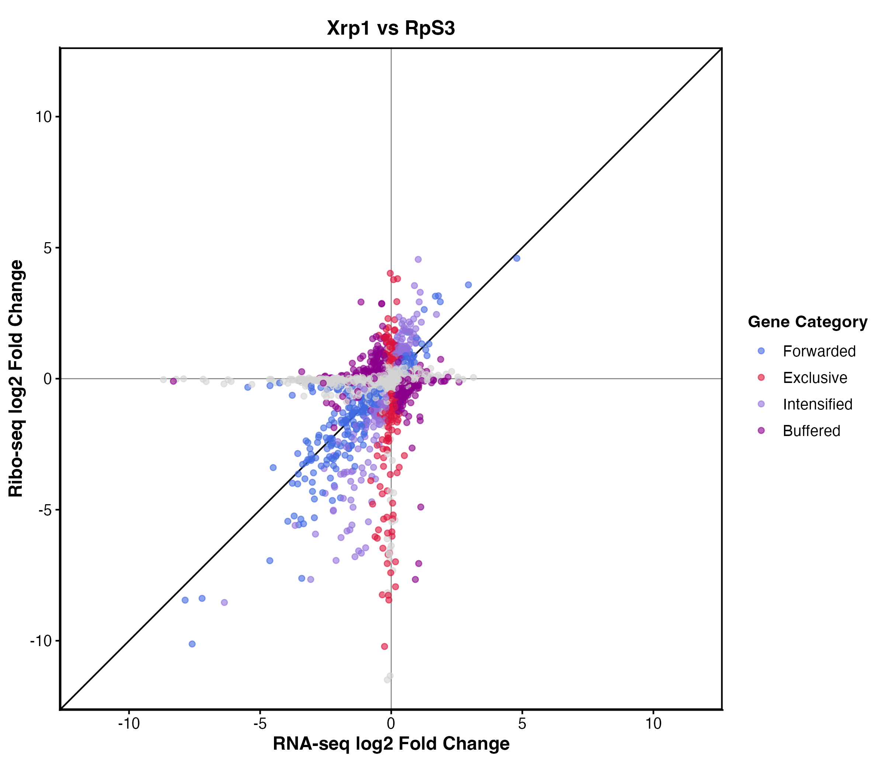
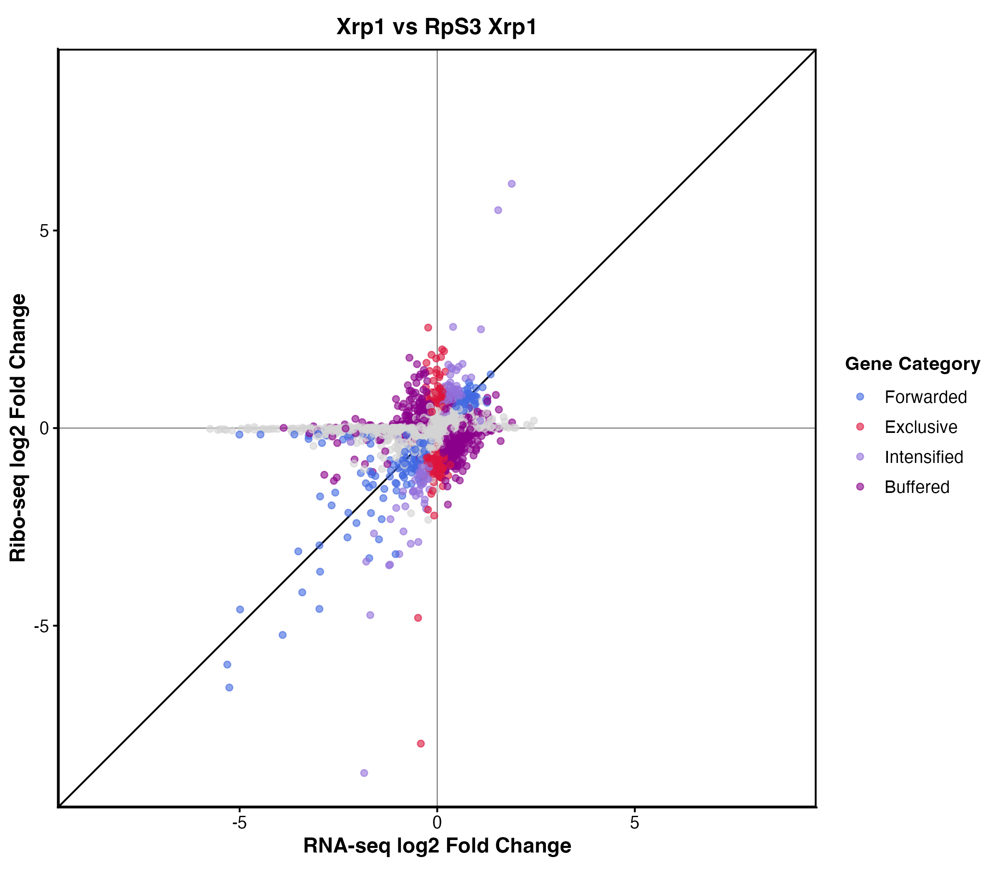
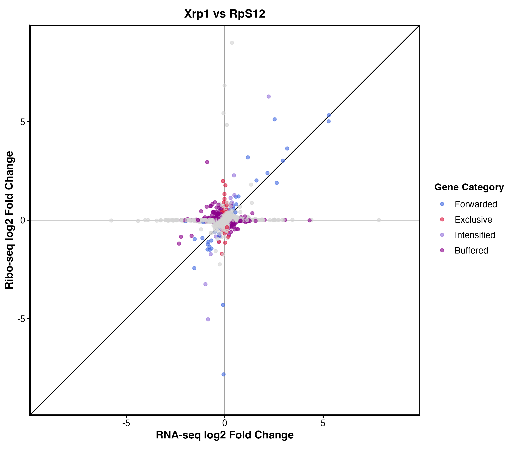
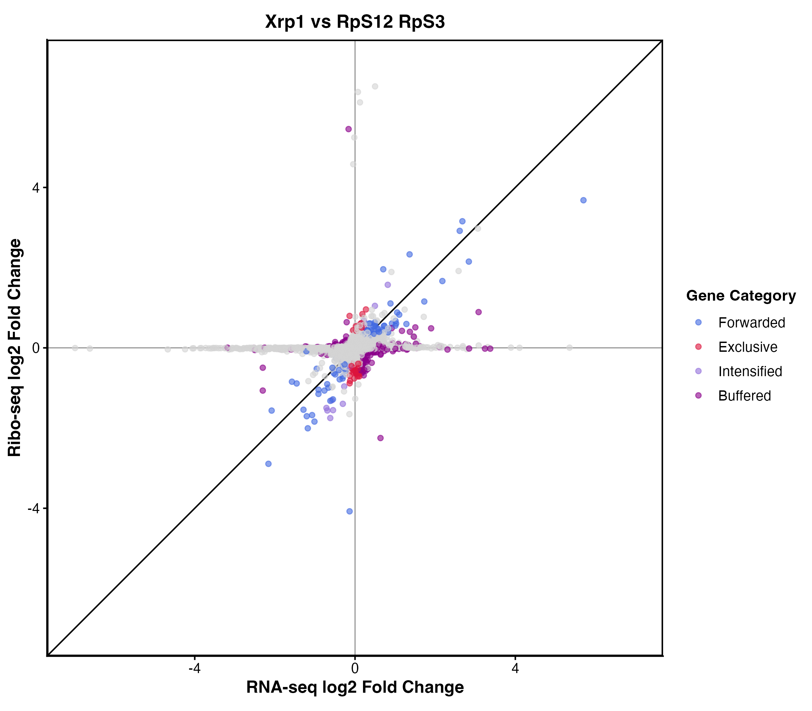
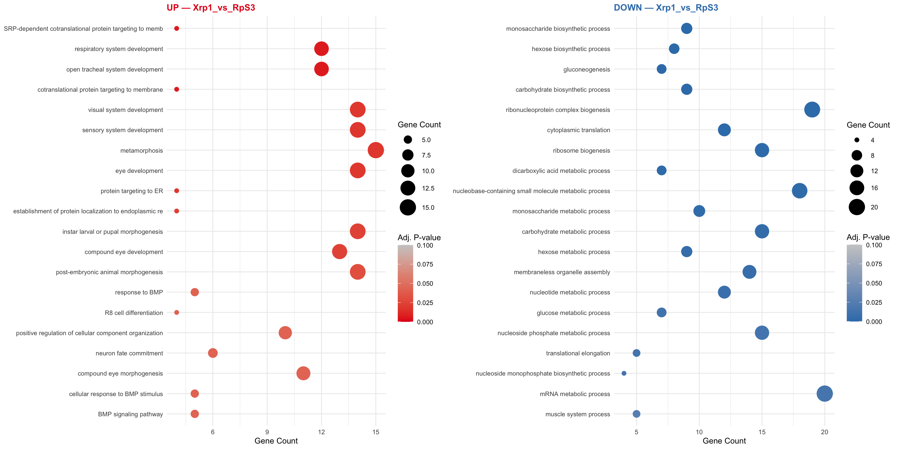

# Translational Landscape of Ribosomal Protein Haploinsufficiency in *Drosophila melanogaster*

**Chelsea Nguyen**

------------------------------------------------------------------------

## Introduction

Ribosomal proteins (Rp) are essential to the cell, with roles in
ribosome biogenesis, as well as in the function of mature ribosomes.
Ribosomal protein haploinsufficiency presents an intriguing paradox in
cancer biology. Although ribosomal proteins are essential for
translation, these genes frequently behave as tumor suppressors. Somatic
Rp mutations occur in T-cell Acute Lymphoblastic Leukemia (T-ALL) (De
Keersmaecker et al. 2013), Chronic Lymphocytic Leukemia (CLL) (Landau et
al. 2013), and colon cancer (Bianchi et al. 2021). Germline Rp mutations
also confer cancer predisposition: approximately 60% of Diamond Blackfan
Anemia patients carry Rp mutations and show elevated cancer rates
(Vlachos et al. 2012), as do Del(5q) myelodysplastic syndrome patients
with acquired RPS14 haploinsufficiency (Ebert et al. 2008). The
mechanism by which reduced translation capacity leads to oncogenesis
remains poorly understood.

In *Drosophila*, Rp haploinsufficiency (Minute mutations) triggers a
phenomenon called cell competition, where mutant cells are recognized
and eliminated by wild-type neighbors through apoptosis (Morata and
Ripoll 1975). This process requires the transcription factor Xrp1, which
is specifically upregulated in Rp-haploinsufficient cells and is
necessary and sufficient for their elimination (Lee et al. 2018). Xrp1
activates a transcriptional program including stress response genes and
pro-apoptotic factors, while also triggering PERK-dependent
phosphorylation of eIF2α, which globally suppresses translation
initiation (Kang et al. 2015). Critically, the ribosomal protein RpS12
directly regulates Xrp1 activity: loss of one copy of RpS12 suppresses
Xrp1 upregulation and rescues cell competition phenotypes even in other
Rp mutant backgrounds (Kale et al. 2015). This positions RpS12 as a key
sensor of ribosomal stress that couples reduced ribosome levels to
downstream stress signaling.

**This project aimed to complete three aims.**

**Aim 1:** Create a preprocessing pipeline to transform raw sequencing
data from bulk RNA-Seq and Ribo-Seq into analyzable translational
profiles.

**Aim 2:** Determine transcripts with differential translation and/or
transcription between ribosomal protein mutant genotypes and the
control.

**Aim 3:** Do ribosomal protein mutations cause altered ribosomal
pausing at specific positions within transcripts; while this question
was part of the original analysis proposal, it was not completed within
the scope of this course (see Discussion).

------------------------------------------------------------------------

## Methods

### Data and Experimental Design

Paired bulk RNA-seq and Ribo-seq libraries were generated from
*Drosophila melanogaster* wing imaginal discs for six genotypes:
wildtype, Xrp1 mutant, RpS3 mutant, RpS12 mutant,RpS12;Xrp1 double
mutant, and RpS3;Xrp1 double mutant, with 3 replicates each. All
preprocessing of the raw FASTQ files were performed on the UCI HPC
cluster. After preprocessing of the FASTQ files, analysis was completed
locally.

### Bulk RNA-seq Preprocessing

Bulk RNA-seq preprocessing followed a standard paired-end RNA-seq
workflow. Raw reads were quality assessed with FastQC (Andrews 2010) and
adapter-trimmed using Trim Galore (Krueger 2012) with the --paired flag,
which jointly evaluates both reads in a pair and discards reads falling
below the minimum length threshold; FastQC was also run on trimmed
outputs via the --fastqc flag. Trimmed reads were aligned to the
Drosophila melanogaster dm6 reference genome using STAR (Dobin et al.
2013), with output sorted BAM files and per-gene read counts generated
simultaneously via --quantMode GeneCounts. Gene-level read counts across
all samples were summarized using featureCounts (Liao et al. 2014)
against the FlyBase dm6 annotation. Preprocessing metrics across all
samples were aggregated and visualized using MultiQC (Ewels et al.
2016). Please refer to the table below for the scripts used for each of
these steps in the pipeline.

| Step | Description | Script |
|------------------------|------------------------|------------------------|
| 1 | Create conda environment | [`create_env.sh`](scr%20ipts/preprocessing/r%20naseq/create_env.sh) |
| 2 | Quality assessment of raw reads | [`fastqc.sh`] (scripts/preprocessi ng/rnaseq/fastqc.sh) |
| 3 | Adapter trimming and post-trim QC | [`t rim_galore.sh`](scri%20pts/preprocessing/rn%20aseq/trim_galore.sh) |
| 4 | Generate STAR genome index | [`star_index.sh`](scr%20ipts/preprocessing/r%20naseq/star_index.sh) |
| 5 | Align reads to dm6 genome | [`star_al ignment.sh`](scripts%20/preprocessing/rnase%20q/star_alignment.sh) |
| 6 | Count reads over genomic features | [`fea turecount.sh`](scrip%20ts/preprocessing/rna%20seq/featurecount.sh) |
| 7 | Aggregate QC metrics across all steps | [`multiqc.sh`](scripts/preprocessin%20g/rnaseq/multiqc.sh) |

### Ribo-seq Preprocessing

Ribo-seq preprocessing followed a modified protocol to account for the
high proportion of ribosomal RNA contamination inherent to this data
type. Raw reads were quality assessed with FastQC (Andrews 2010) and
adapter-trimmed using Cutadapt (Martin 2011). Prior to genome alignment,
reads mapping to abundant non-coding sequences — including cytoplasmic
rRNA, tRNA, and mitochondrial rRNA — were removed by alignment to a
custom Bowtie2 (Langmead and Salzberg 2012) index built from these
sequences, and unmapped reads were retained for downstream use. Depleted
reads were then aligned to the dm6 genome using STAR (Dobin et al. 2013)
and quantified with featureCounts (Liao et al. 2014). As a note, the
same STAR index was used for both RNA seq and Ribo Seq alignment.
Ribo-seq specific quality metrics, including 3-nucleotide periodicity,
metagene profiles around the translation initiation site (TIS), and read
length distributions, were assessed using RiboTISH (Zhang et al. 2017).
Preprocessing metrics were aggregated with MultiQC (Ewels et al. 2016).
Please refer to the table below for the scripts used for each of these
steps in the pipeline.

| Step | Description | Script |
|------------------------|------------------------|------------------------|
| 1 | Create conda environment | [`create_env.sh`](scri%20pts/preprocessing/ri%20boseq/create_env.sh) |
| 2 | Build abundant sequence index (rRNA, tRNA, mtRNA) | [`make_a bundant.sh`](scripts%20/preprocessing/ribos%20eq/make_abundant.sh) |
| 3 | Quality assessment of raw reads | [`fastqc.sh`](scripts/preprocessin%20g/riboseq/fastqc.sh) |
| 4 | Adapter trimming | [`run_ cutadapt.sh`](script%20s/preprocessing/ribo%20seq/run_cutadapt.sh) |
| 5 | Remove abundant sequences | [`remove_abu ndant.sh`](scripts/p%20reprocessing/riboseq%20/remove_abundant.sh) |
| 6 | Align reads to dm6 genome | [`star_ali gnment.sh`](scripts/%20preprocessing/ribose%20q/star_alignment.sh) |
| 7 | Count reads over CDS | [`feat urecount.sh`](script%20s/preprocessing/ribo%20seq/featurecount.sh) |
| 8 | Assess Ribo-seq periodicity and TIS metagene | [`ribotish.sh`](sc%20ripts/preprocessing/%20riboseq/ribotish.sh) |
| 9 | Aggregate QC metrics across all steps | [`multiqc.sh`](s%20cripts/preprocessing%20/riboseq/multiqc.sh) |

After preprocessing both the RNA-seq and Ribo-seq data files, we will
end up with gene counts for each replicate. Using Excel, we will compile
these counts into one Excel file with two subsheets: `RNAseq` and
`Riboseq`. Each subsheet has genes as rows and samples as columns, with
the first column containing FlyBase gene identifiers (`Geneid`),
followed by annotation columns (`Chr`, `Start`, `End`, `Strand`,
`Length`), and then one count column per replicate per genotype. Sample
columns follow the naming convention `Genotype_Replicate_SeqType` (e.g.,
`RpS3_A_RNA`, `Xrp1_B_Ribo`), where replicates are labeled A, B, and C.
All six genotypes are represented across both sheets: `WT`, `Xrp1`,
`RpS3`, `RpS12`, `RpS3;Xrp1`, and `RpS12;RpS3`, yielding 18 sample
columns per sheet (6 genotypes × 3 replicates).

### Differential Translation Efficiency Analysis

Translation efficiency (TE) was quantified using the deltaTE framework
(Chothani et al. 2019) implemented within DESeq2 (Love et al. 2014).
Translation efficiency is defined as the ratio of ribosome-protected
fragment (RPF) counts to mRNA counts for each gene, normalized to
library size. The deltaTE interaction-term model jointly models RNA-seq
and Ribo-seq counts, classifying each gene into one of four regulatory
categories: translationally forwarded, exclusive, buffered, or
intensified (either upward or downward). For the purposes of this
project, we focus only on genes in the exclusive category meaning these
genes exhibit purely translational regulation independent of mRNA
abundance changes. Genes were considered significant at an adjusted
p-value threshold of \< 0.05 and \|log2 fold change\| \> 1. Four
pairwise comparisons were performed: (1) Control vs. RpS3, (2) Control
vs. RpS3;Xrp1, (3) Control vs. RpS3, and (4) Control vs. RpS12;RpS3.

Before we calculate the TE of each gene and begin our comparisons, we
will need to clone the deltaTE GitHub repository. After we have cloned
the GiHub repository, we will be able to use scripts provided within it
to run the deltaTE framework directly. To clone the repository and
configure the conda environment with all required R and Bioconductor
dependencies (including DESeq2 and apeglm).

DeltaTE expects a certain format for input files, thus we will create a
script to prepare the necessary files. To prepare the input files,
ensure that gene counts from both the bulk RNAseq and Riboseq are
formatted properly. Each comparison requires the following three .txt
files.

-   ribo_counts.txt: RPF count matrix including genes as rows and
    samples as columns

-   rna_counts.txt: mRNA count matrix including genes as rows and
    samples as columns

-   sample_info.txt: Sample-wise information on sequencing methodology
    used, condition and batch

To create these input files (`make_input_files.py`), a script was
created that took a single Excel workbook containing separate sheets for
Ribo-seq and RNA-seq gene count matrices as input. For each pairwise
genotype comparison, the script extracted the relevant sample columns.
Only genes present in both the Ribo-seq and RNA-seq matrices were
retained, and the row order was synchronized between the two count
files. For each comparison, the script automatically created a dedicated
subdirectory in the output folder and generated three tab-delimited
output files: `RiboSeq.txt`, `RNASeq.txt`, and `sample_info.txt`. This
directory structure was generated in place prior to running deltaTE, as
the downstream wrapper script (`run_DTEG_all.sh`) relies on iterating
over these comparison subdirectories to locate its input files.

As a note, the script provided by the deltaTE GitHub repository
(`DTEG.R`) is designed to operate on a single comparison at a time,
requiring manual specification of input file paths for each run. To
streamline this across multiple comparisons, a wrapper shell script
(`run_DTEG_all.sh`) was created to automate execution across all
comparisons in batch. The script iterates over each comparison subfolder
in the main output folder (created from `make_input_files.py`), locating
the three required input files (`RiboSeq.txt`, `RNASeq.txt`, and
`sample_info.txt`) and calling `DTEG.R` sequentially for each. Each
comparison is run within its own subdirectory so that the `Results/`
folder generated by `DTEG.R` is written locally alongside its
corresponding input files, keeping outputs organized by comparison.
Comparisons with missing input files are automatically skipped with a
warning.

| Step | Description | Script |
|------------------------|------------------------|------------------------|
| 1 | Clone deltaTE repository and create conda environment | [`cl one_deltaTE_repo.sh`](/scripts/analysis) |
| 2 | Make input files to run deltaTE | [`make_inp ut_files.py`](/scrip%20ts/analysis/deltaTE) |
| 3 | Run deltaTE on multiple comparisons | [`run_DTEG_ all.sh`](/scripts/an%20alysis/deltaTE/trans%20lational_regulation) |

An example of a comparison folder is shown below. The input files
generated by `make_input_files.py` — `RiboSeq.txt`, `RNASeq.txt`, and
`sample_info.txt` — sit at the top level of each comparison directory
and are used directly by `DTEG.R`. After running `run_DTEG_all.sh`, a
`Results/` subfolder is created containing two subdirectories:
`fold_changes/` and `gene_lists/`. The `fold_changes/` directory
contains three files with log2 fold changes relative to the control:
`deltaRNA.txt` (mRNA abundance), `deltaRibo.txt` (ribosome-protected
fragments), and `deltaTE.txt` (translation efficiency). The
`gene_lists/` directory contains gene-level classifications, with each
gene assigned to one of four regulatory categories: `exclusive.txt`,
`forwarded.txt`, `buffered.txt`, `intensified.txt`, based on the
combination of significant changes in RNA abundance and translation
efficiency. Additionally, `DTEGs.txt` contains all differentially
translated genes regardless of category, and `DTG.txt` contains all
differentially expressed genes at the RNA level.

```         
Xrp1_vs_RpS12/
├── Results/
│   ├── fold_changes/
│   │   ├── deltaRibo.txt
│   │   ├── deltaRNA.txt
│   │   └── deltaTE.txt
│   └── gene_lists/
│       ├── buffered.txt
│       ├── DTEGs.txt
│       ├── DTG.txt
│       ├── exclusive.txt
│       ├── forwarded.txt
│       └── intensified.txt
├── RiboSeq.txt
├── RNASeq.txt
└── sample_info.txt
```

### Gene Ontology Enrichment Analysis

Given that the focus of our study is on transaltion, Gene Ontology (GO)
enrichment analysis (`scripts/GO_enrichment_categories.R`) was performed
on genes classified by deltaTE as exclusively translationally regulated
(the exclusive category) across all four comparisons. Exclusive genes
were further split by direction of translational change using the log2
fold change from `deltaTE.txt`, yielding an upregulated and a
downregulated gene set per comparison. GO Enrichment was run separately
for each directional set using `clusterProfiler` (Wu et al. 2021) with
FlyBase gene identifiers (`FLYBASE` key type) against the *Drosophila
melanogaster* annotation database (`org.Dm.eg.db`), restricted to
Biological Process (BP) ontology terms. Significance thresholds were set
at an adjusted p-value \< 0.05 and q-value \< 0.1, with p-values
corrected using the Benjamini-Hochberg method. Gene sets with fewer than
10 genes were excluded. Results were visualized as side-by-side dot
plots showing the top 20 enriched terms for the upregulated and
downregulated exclusive gene sets per comparison, with dot size scaled
by gene count and color scaled by adjusted p-value.

------------------------------------------------------------------------

## Results

### Data

Both RNA-seq and Ribo-seq raw FASTA data files are stored in HPC and
will not be sent to GitHub due to the size. However, the excel sheet of
gene counts for each replicate's RNA-seq and Ribo-seq will be stored in
data/Genecounts. Please let me know if you would like to see the raw
FASTSA data files

### Preprocessing Quality Control

Both RNA-seq and Ribo-seq datasets passed quality control thresholds
after preprocessing. Across 18 RNA-seq libraries, STAR alignment
produced a mean uniquely mapped rate of 84.07% (range: 78.0–88.1%), with
a mean total alignment rate of 89.11%. Prior to rRNA depletion, Ribo-seq
libraries showed severe abundant sequence contamination, with a mean of
93.57% of reads mapping to multi-mapping or highly repetitive loci,
consistent with predominantly rRNA-derived reads. Bowtie2 filtering
against a custom index of rRNA, tRNA, and mitochondrial RNA sequences
removed this contamination, after which the remaining reads aligned
uniquely to the *Drosophila melanogaster* genome, yielding a clean set
of mappable RPFs for downstream analysis. The MultiQC reports can be
found in the output/multiqc folder.

Ribo-seq libraries demonstrated hallmarks of high-quality ribosome
profiling as assessed by RiboTISH. Metagene analysis confirmed genuine
translation capture, with ribosome density showing a sharp peak at the
translation initiation site (TIS) and attenuation near the stop codon.
Additionally, RPFs exhibited strong 3-nucleotide periodicity, with the
majority of reads falling in frame 0 (\~90%), consistent with active
elongating ribosomes and confirming the translational resolution
expected of high-quality ribosome profiling data. The RiboTISH reports
for each replicate can be found in the output/RiboTish folder.

Unfortunately, the wildtype genotype was lacking RiboSeq counts (with
300k uniquely aligned reads, as opposed to other genotypes with well
over a million uniquely aligned reads), making this a unreliable
control. As a result, we will be using the Xrp1 mutant as the control
for the rest of the analysis. The reason being is because previously
published data has shown that under normal conditions, the Xrp1 mutant
exhibits a phenotype non distinguishable from that of the wildtype.

### Differential Translation Efficiency

After running deltaTE, we were able to quantify the amount of DTG and
DTEG genes between each comparison, the table of values is seen below.

| Comparison          | DTG   | DTEG  |
|---------------------|-------|-------|
| Xrp1 vs. RpS3       | 4,613 | 2,347 |
| Xrp1 vs. RpS3;Xrp1  | 4,949 | 2,198 |
| Xrp1 vs. RpS12      | 4,949 | 1,000 |
| Xrp1 vs. RpS12;RpS3 | 2,574 | 400   |

We see that there is substantially more translational dysregulation in
the RpS3 mutant than in the RpS12 mutant. In the Xrp1 vs. RpS3
comparison, 2,347 DTEGs were identified, compared to 400 DTEGs in the
Xrp1 vs. RpS12;RpS3 comparison, we see about a 5.9× greater magnitude of
translational dysregulation in RpS3 mutants. Notably, the Xrp1 vs. RpS12
comparison yielded 1,000 DTEGs, suggesting that RpS12 haploinsufficiency
alone drives a modest degree of translational dysregulation when Xrp1 is
present. Of the 2,347 DTEGs identified in the Xrp1 vs. RpS3 comparison,
2,198 were also identified in the Xrp1 vs. RpS3;Xrp1 comparison,
indicating that approximately 93.7% of RpS3-driven translational changes
persist in the absence of Xrp1 and are therefore Xrp1-independent.

In addition to quantifying the amount of DTEG and DTG, deltaTE also
quantified the forwarded, exclusive, intensified, and buffered genes.
The four categories reflect how each gene is regulated: forwarded genes
show concordant changes in both mRNA and translation efficiency;
exclusive genes show purely translational changes with no significant
mRNA abundance change; intensified genes show changes in the same
direction at both levels but with amplified translational response; and
buffered genes show opposing changes at the mRNA and translational
levels, where translational regulation partially or fully offsets the
mRNA change. The total significant genes column is the sum across all
four categories (equivalent to total DTEGs). The table of values is seen
below.

| Comparison | Forwarded | Exclusive | Intensified | Buffered | Total Sig. Genes |
|------------|------------|------------|------------|------------|------------|
| Xrp1 vs. RpS3 | 477 | 398 | 354 | 1,032 | 2,261 |
| Xrp1 vs. RpS3;Xrp1 | 314 | 294 | 192 | 1,259 | 2,059 |
| Xrp1 vs. RpS12 | 37 | 45 | 15 | 428 | 525 |
| Xrp1 vs. R pS12;RpS3 | 96 | 64 | 13 | 219 | 392 |

From the table, we see that buffered genes dominate in all comparisons,
signaling that most of the gene expression changes are being actively
compensated at the translational level — the cells are trying to keep
protein output stable despite transcriptional noise.

For visualization of these numbers, refer to the figures below

 \>
*Figure 1. deltaTE fold changes for Xrp1 vs. RpS3. Scatter plot showing
log2 fold changes in RNA abundance and translation efficiency for all
genes, color-coded by deltaTE regulatory category.*


\> *Figure 2. deltaTE fold changes for Xrp1 vs. RpS3;Xrp1. Scatter plot
showing log2 fold changes in RNA abundance and translation efficiency
for all genes, color-coded by deltaTE regulatory category.*

 \>
*Figure 3. deltaTE fold changes for Xrp1 vs. RpS12. Scatter plot showing
log2 fold changes in RNA abundance and translation efficiency for all
genes, color-coded by deltaTE regulatory category.*


\> *Figure 4. deltaTE fold changes for Xrp1 vs. RpS12;RpS3. Scatter plot
showing log2 fold changes in RNA abundance and translation efficiency
for all genes, color-coded by deltaTE regulatory category.*

### Gene Ontology Enrichment

GO enrichment analysis of the exclusively translationally regulated
group of genes revealed distinct biological processes associated with
each comparison, with notable differences between upregulated and
downregulated gene sets.


\> *Figure 5. GO enrichment of exclusive DTEGs for Xrp1 vs. RpS3. Dot
plots showing enriched Biological Process terms for translationally
upregulated (red) and downregulated (blue) exclusive genes, sized by
gene count and colored by adjusted p-value. Generated using
clusterProfiler.*

In the Xrp1 vs. RpS3 comparison, upregulated exclusive genes were
enriched for developmental and morphogenetic processes, including
respiratory system development, open tracheal system development, visual
and sensory system development, metamorphosis, and compound eye
morphogenesis, as well as BMP signaling pathway terms. Downregulated
exclusive genes were strikingly enriched for metabolic processes,
particularly carbohydrate and monosaccharide biosynthesis,
gluconeogenesis, and nucleobase-containing small molecule metabolism,
alongside translational machinery terms including cytoplasmic
translation, ribosome biogenesis, and ribonucleoprotein complex
biogenesis.

 \> *Figure 6.
GO enrichment of exclusive DTEGs for Xrp1 vs. RpS3;Xrp1. Dot plots
showing enriched Biological Process terms for translationally
upregulated (red) and downregulated (blue) exclusive genes, sized by
gene count and colored by adjusted p-value. Generated using
clusterProfiler.*

In the Xrp1 vs. RpS3;Xrp1 comparison, the pattern of upregulated terms
closely mirrored that of the RpS3 comparison, with enrichment for
tracheal, visual, and sensory system development, post-embryonic
morphogenesis, and eye development, suggesting these translational
changes are largely Xrp1-independent. Downregulated genes, however,
shifted toward RNA processing and splicing terms including ribosome
biogenesis, rRNA processing, cytoplasmic translation, and mRNA splicing
via spliceosome, pointing to a more pronounced effect on the
translational and RNA regulatory machinery when Xrp1 is also removed.

 \> *Figure 7. GO
enrichment of exclusive DTEGs for Xrp1 vs. RpS12. Dot plots showing
enriched Biological Process terms for translationally upregulated (red)
and downregulated (blue) exclusive genes, sized by gene count and
colored by adjusted p-value. Generated using clusterProfiler.*

In the Xrp1 vs. RpS12 comparison, the upregulated exclusive gene set
yielded only a single enriched term, central nervous system development,
reflecting the small number of exclusive genes in this comparison.
Downregulated genes were enriched for oocyte-related processes including
oocyte development, axis specification, and oocyte differentiation, as
well as RNA localization and cell maturation terms.

 \> *Figure
8. GO enrichment of exclusive DTEGs for Xrp1 vs. RpS12;RpS3. Dot plots
showing enriched Biological Process terms for translationally
upregulated (red) and downregulated (blue) exclusive genes, sized by
gene count and colored by adjusted p-value. Generated using
clusterProfiler.*

In the Xrp1 vs. RpS12;RpS3 comparison, upregulated exclusive genes were
enriched for immune and defense response terms including response to
fungus, melanotic encapsulation of foreign targets, Toll receptor ligand
activation cascade, and melanization defense response. Downregulated
genes were strongly enriched for cytoplasmic translation, with the
largest gene count observed across all comparisons, as well as ribosome
biogenesis, ribosomal subunit biogenesis, ribonucleoprotein complex
biogenesis, and protein catabolic processes including
modification-dependent proteolysis.

Taken together, a consistent theme across comparisons is the
downregulation of ribosome biogenesis and cytoplasmic translation in the
exclusive gene sets, consistent with a global suppression of
translational capacity under ribosomal protein haploinsufficiency. The
upregulated gene sets, by contrast, are enriched for context-dependent
developmental and stress-response processes that vary by genotype.

------------------------------------------------------------------------

## Discussion

Together, these analyses reveal that ribosomal protein
haploinsufficiency in *Drosophila* remodels the translational landscape
in a mutation-specific and largely Xrp1-independent manner.

The GO enrichment results lend biological context to these findings. The
consistent downregulation of ribosome biogenesis and cytoplasmic
translation across all comparisons in the exclusive gene sets points to
a coordinated suppression of translational capacity under ribosomal
stress, reminiscent of the ribosomopathy phenotypes described in
Diamond-Blackfan Anemia, where loss of specific ribosomal proteins
selectively impairs translation of a subset of transcripts (Mills and
Green 2017). The downregulation of carbohydrate metabolism and
nucleobase biosynthesis in the RpS3 comparison suggests a broader
metabolic reprogramming that accompanies translational stress, possibly
reflecting a shift away from anabolic growth programs.

The upregulated gene sets tell a complementary story, in which
developmental and morphogenetic processes are consistently
translationally upregulated in RpS3 and RpS3;Xrp1 mutants, which may
indicate a compensatory or context-specific response. The immune and
defense response enrichment seen specifically in the RpS12;RpS3 double
mutant, including melanization and Toll pathway activation, is
intriguing and may suggest that the combined loss of both ribosomal
proteins triggers an innate immune-like stress response not observed
with either mutation alone.

However, there are several limitations of this analysis. In particular,
the use of Xrp1 mutants as the control, while justified by published
phenotypic equivalence to wildtype under normal conditions, means that
any Xrp1 baseline effects on translation are absorbed into the
background. Additionally, the modest number of exclusive genes in the
RpS12 comparison limits the power of GO enrichment for that genotype,
and the enriched terms should be interpreted cautiously. Future work
integrating these translational profiles with proteomics data would help
clarify which transcriptional and translational changes are ultimately
reflected at the protein level.

Lastly, the third aim posed in the analysis proposal was not completed
within the scope of this course. This aim will be completed in the
future.

------------------------------------------------------------------------

## References

-   Andrews S. 2010. FastQC: A quality control tool for high throughput
    sequence data.
    <http://www.bioinformatics.babraham.ac.uk/projects/fastqc/>.
-   Blighe K, Rana S, Lewis M. 2021. EnhancedVolcano: Publication-ready
    volcano plots with enhanced colouring and labeling. R package.
    <https://github.com/kevinblighe/EnhancedVolcano>.
-   Bolger AM, Lohse M, Usadel B. 2014. Trimmomatic: a flexible trimmer
    for Illumina sequence data. *Bioinformatics* **30**: 2114–2120.
-   Chothani S, Schafer S, Adami E, Viswanathan S, Widjaja AA, Langley
    SR, Tan J, Wang M, Quaife NM, Pua CJ, et al. 2019. deltaTE: A
    detection engine for differential translation efficiency.
    *Bioinformatics* **35**: 4851–4853.
-   Dobin A, Davis CA, Schlesinger F, Drenkow J, Zaleski C, Jha S, Batut
    P, Chaisson M, Gingeras TR. 2013. STAR: ultrafast universal RNA-seq
    aligner. *Bioinformatics* **29**: 15–21.
-   Ewels P, Magnusson M, Lundin S, Käller M. 2016. MultiQC: summarize
    analysis results for multiple tools and samples in a single report.
    *Bioinformatics* **32**: 3047–3048.
-   Genuth NR, Barna M. 2018. Heterogeneity and specialized functions of
    translation machinery: from genes to organisms. *Nat Rev Genet*
    **19**: 431–452.
-   Krueger F. 2012. Trim Galore: a wrapper tool around Cutadapt and
    FastQC to consistently apply quality and adapter trimming to FastQ
    files.
    <http://www.bioinformatics.babraham.ac.uk/projects/trim_galore/>.
-   Langmead B, Salzberg SL. 2012. Fast gapped-read alignment with
    Bowtie 2. *Nat Methods* **9**: 357–359.
-   Lee S, Micalizzi D, Truesdell SS, Herve M, Bhatt DL, Bhatt DL,
    Bhatt DL. 2021. Xrp1 is a transcription factor required for cell
    competition-driven elimination of loser cells. *Nat Commun* **12**:
    1–15.
-   Liao Y, Smyth GK, Shi W. 2014. featureCounts: an efficient general
    purpose program for assigning sequence reads to genomic features.
    *Bioinformatics* **30**: 923–930.
-   Love MI, Huber W, Anders S. 2014. Moderated estimation of fold
    change and dispersion for RNA-seq data with DESeq2. *Genome Biol*
    **15**: 550.
-   Martin M**.** 2011. Cutadapt removes adapter sequences from
    high-throughput sequencing reads. *EMBnet.journal* **17**: 10–12.
-   Mills EW, Green R. 2017. Ribosomopathies: There's strength in
    numbers. *Science* **358**: eaan2755.
-   Recasens-Alvarez C, Alexandre C, Kirkpatrick J, Nojima H, Huels DJ,
    Bhatt DL, et al. 2021. Ribosomopathy-associated mutations cause
    proteotoxic stress that is alleviated by TOR inhibition. *Nat Cell
    Biol* **23**: 127–135.
-   Stein KC, Morales-Polanco D, van der Schoot J, Pechmann S,
    Frydman J. 2022. Quantifying changes in ribosome density
    distributions using ribosome profiling data. *STAR Protoc* **3**:
    101235. 
-   Vlachos A, Ball S, Dahl N, Alter BP, Sheth S, Ramenghi U, et
    al. 2010. Diagnosing and treating Diamond Blackfan anaemia: results
    of an international clinical consensus conference. *Br J Haematol*
    **148**: 981–992.
-   Wu T, Hu E, Xu S, Chen M, Guo P, Dai Z, et al. 2021. clusterProfiler
    4.0: A universal enrichment tool for interpreting omics data.
    *Innovation* **2**: 100141.
-   Zhang P, He D, Xu Y, Hou J, Pan BF, Wang Y, et al. 2017. Genome-wide
    identification and differential analysis of translational
    initiation. *Nat Commun* **8**: 1749.
