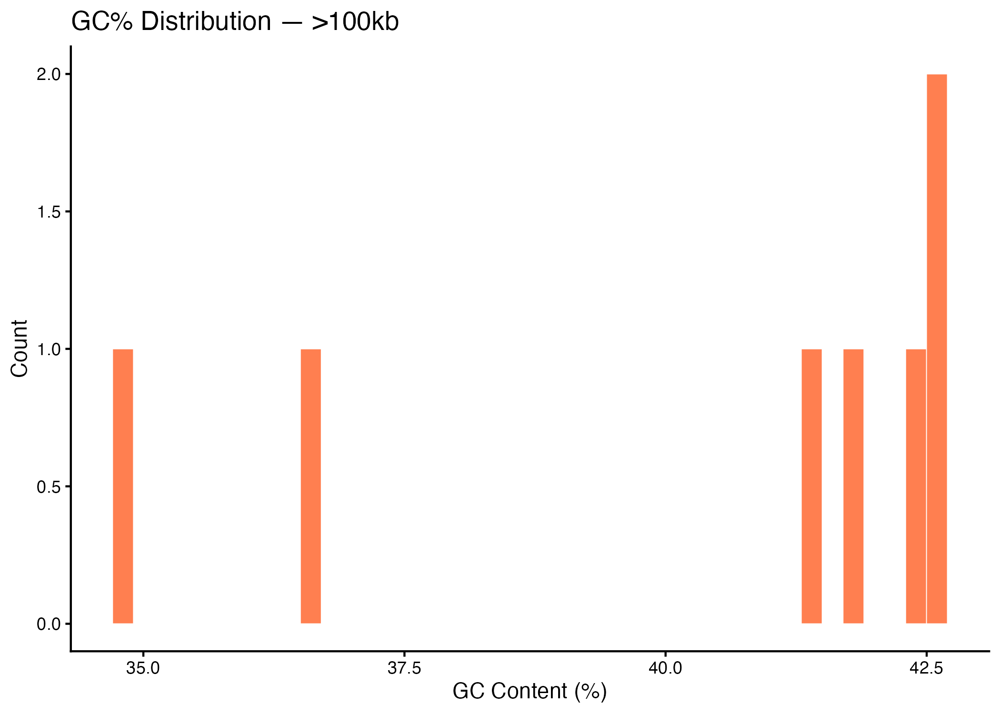
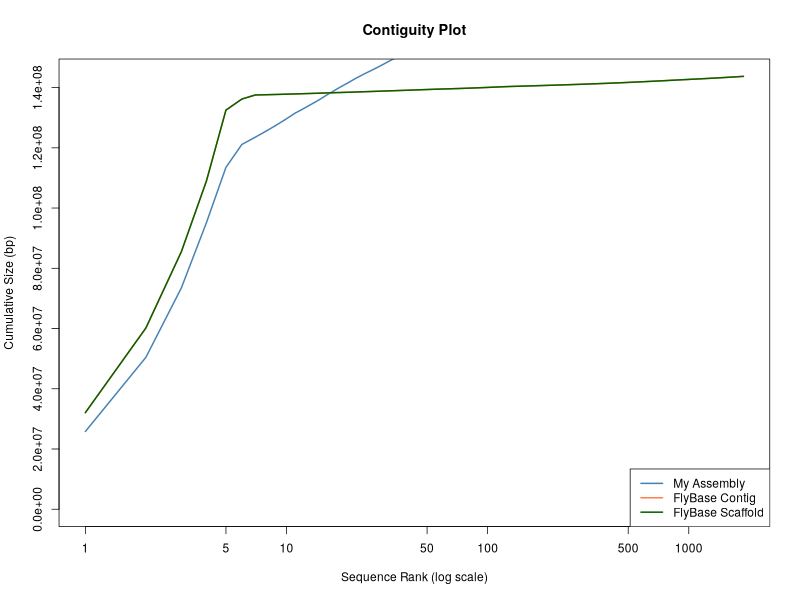

# Homework 4
**Chelsea Nguyen**
**EE282 | Spring 2026**

---

## Organization of Files 
The directory is seen below. This assignment was completed using a combination of local and hpc3. They were eventually all merged together into the following tree organization.
The Output folder is the output from the scripts ran in the Scripts folder, ran locally. The Plots folder has a copy of all the png's from the Output folder, to be referred to in the Markdown document.
As a note, large data files that were generated from the Output files were not pushed to Github, if you would like to see them, please let me know!

<pre>
├── homework4.html
├── homework4.md
├── output/
│   ├── cdf_large.png
│   ├── cdf_small.png
│   ├── gc_hist_large.png
│   ├── gc_hist_small.png
│   ├── large_seqs.fa
│   ├── large_stats.tsv
│   ├── length_hist_large.png
│   ├── length_hist_small.png
│   ├── small_seqs.fa
│   └── small_stats.tsv
├── plots/
│   ├── cdf_large.png
│   ├── cdf_small.png
│   ├── contiguity_plot.png
│   ├── gc_hist_large.png
│   ├── gc_hist_small.png
│   ├── length_hist_large.png
│   └── length_hist_small.png
├── references/
│   ├── dmel-all-chromosome-r6.66.fasta.gz
│   ├── dmel-all-r6.66.gtf.gz
│   └── GCA_000001215.4_Release_6_plus_ISO1_MT_genomic.fna
└── scripts/
    ├── assemble_genome.sh
    ├── assembly_assessment.sh
    ├── busco_score.sh
    ├── genome_plots.R
    └── genome_summary.sh
</pre>


## Part 1: Genome Assembly Partitioning

### Methods
The *Drosophila melanogaster* genome (r6.66) was downloaded from FlyBase and partitioned into two groups: sequences ≤100kb and sequences >100kb using `faFilter`. Summary statistics were calculated with `faSize` and sequence lengths and GC% were extracted with `bioawk`. Plots were generated in R. This part of the assignment was done locally on my personal computer. 

See script: [`scripts/genome_summary.sh`](scripts/genome_summary.sh)
See plots script: [`scripts/genome_plots.R`](scripts/genome_plots.R)

### Summary Statistics

| Metric | ≤100kb | >100kb |
|---|---|---|
| Total nucleotides | 6,178,042 | 137,547,960 |
| Total Ns | 662,593 | 490,385 |
| Total sequences | 1,863 | 7 |

### Plots

#### Sequence Length Distribution


#### GC% Distribution



#### Cumulative Sequence Size


---

## Part 2: Genome Assembly

### Methods
PacBio HiFi reads (`ISO_HiFi_Shukla2025.fasta.gz`) were assembled using `hifiasm` with 16 threads. The primary contig assembly was extracted from the `.bp.p_ctg.gfa` output using `awk`.

See script: [`scripts/assemble_genome.sh`](scripts/assemble_genome.sh)
```bash
hifiasm -o iso1_assembly -t 16 ISO_HiFi_Shukla2025.fasta.gz
awk '/^S/{print ">"$2"\n"$3}' iso1_assembly.bp.p_ctg.gfa > iso1_assembly.bp.p_ctg.fa
```

---

## Part 3: Assembly Assessment

See script: [`scripts/assembly_assessment.sh`](scripts/assembly_assessment.sh)

### N50 Comparison

| Assembly | N50 | Total Bases | Sequences | Ns |
|---|---|---|---|---|
| My Assembly (hifiasm) | 21,715,751 bp | 159,110,016 | 151 | 0 |
| FlyBase r6.66 Contig | ~21,000,000 bp | ~143,000,000 | many | many |

The hifiasm assembly achieves a comparable N50 to the FlyBase community reference and contains **zero Ns**, reflecting the gap-free nature of HiFi-based assemblies.

### Contiguity Plot



### BUSCO Scores (via compleasm, diptera_odb12)

| Metric | My Assembly | FlyBase Contig |
|---|---|---|
| Single (S) | 99.39% (5,035) | 99.39% (5,035) |
| Duplicated (D) | 0.39% (20) | 0.47% (24) |
| Fragmented (F) | 0.14% (7) | 0.14% (7) |
| Incomplete (I) | 0.00% (0) | 0.00% (0) |
| Missing (M) | 0.08% (4) | 0.00% (0) |
| **Total BUSCOs** | **5,066** | **5,066** |

Both assemblies achieve ~99.4% BUSCO completeness against the diptera_odb12 lineage dataset, indicating high quality. The hifiasm assembly is missing 4 BUSCOs present in the FlyBase reference, which is negligible. The slightly lower duplication rate in the hifiasm assembly (0.39% vs 0.47%) is consistent with assembling a homozygous inbred iso-1 line.

See script: [`scripts/busco_score.sh`](scripts/busco_score.sh)

---


