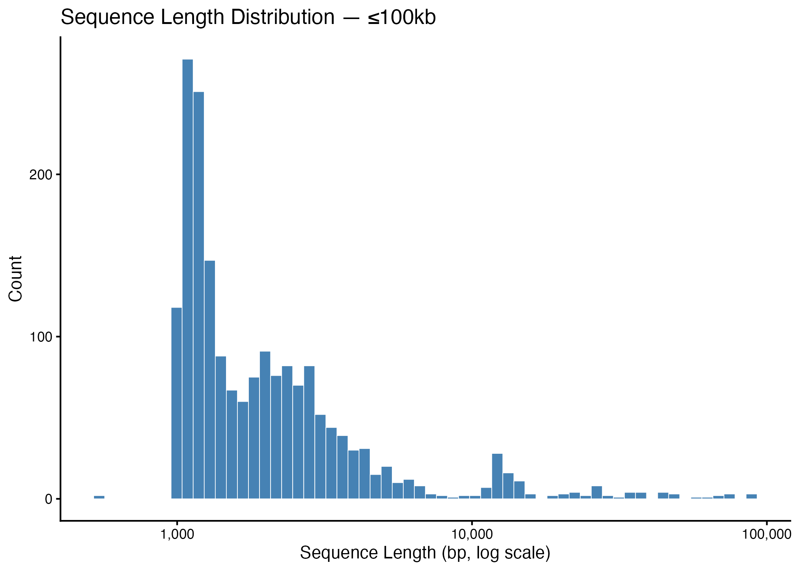
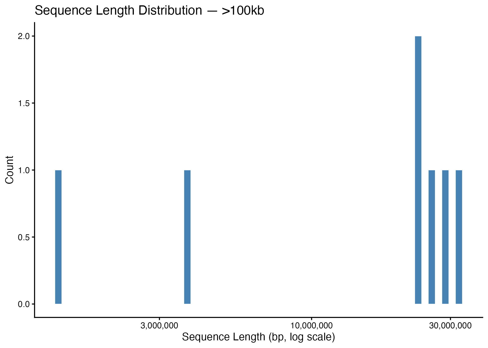
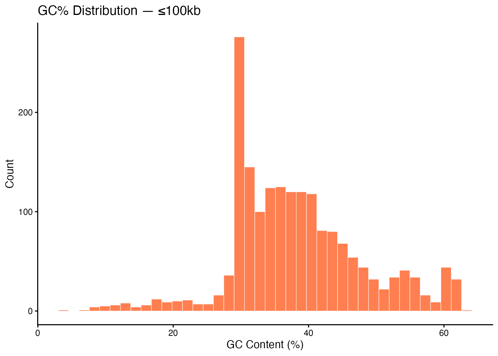
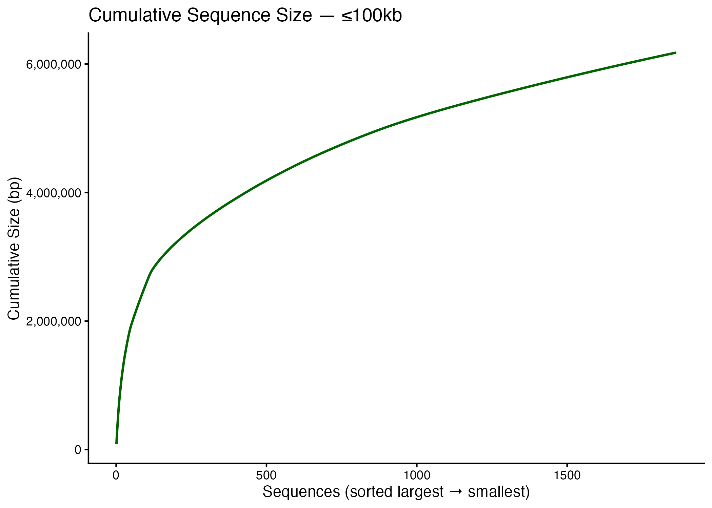
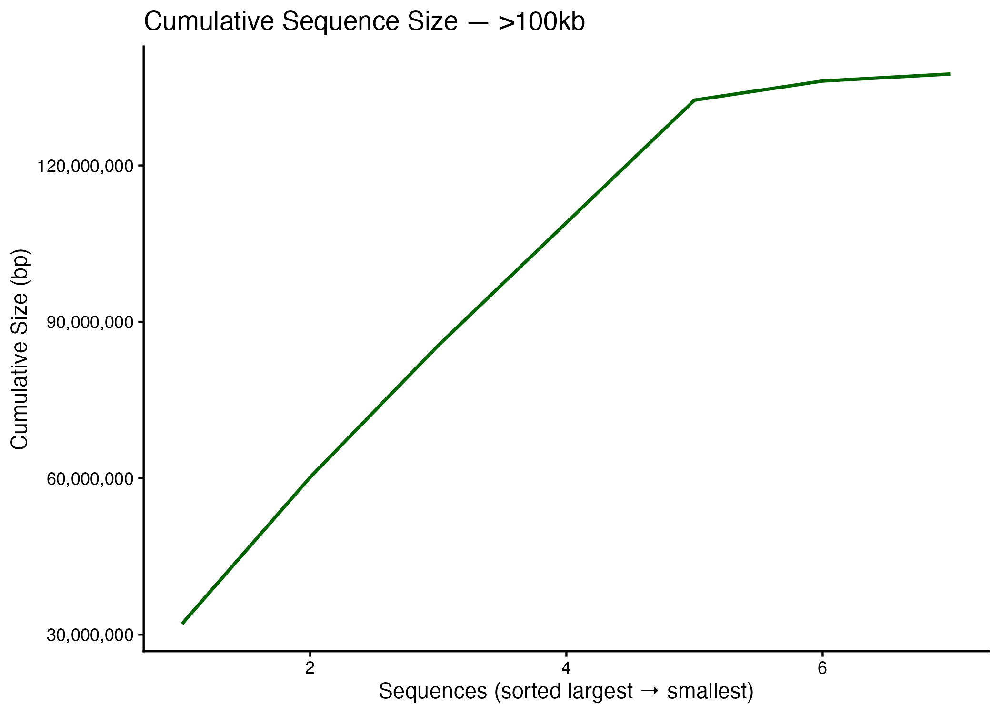

# Homework 4
**Chelsea Nguyen**
**EE282 | Spring 2026**

---

## Part 1: Genome Assembly Partitioning

### Methods
The *Drosophila melanogaster* genome (r6.66) was downloaded from FlyBase and partitioned into two groups: sequences ≤100kb and sequences >100kb using `faFilter`. Summary statistics were calculated with `faSize` and sequence lengths and GC% were extracted with `bioawk`. Plots were generated in R.

See script: [`scripts/hw4_genome_summary.sh`](scripts/genome_summary.sh)
See plots script: [`scripts/hw4_genome_plots.R`](scripts/genome_plots.R)

### Summary Statistics

| Metric | ≤100kb | >100kb |
|---|---|---|
| Total nucleotides | 6,178,042 | 137,547,960 |
| Total Ns | 662,593 | 490,385 |
| Total sequences | 1,863 | 7 |

### Plots

#### Sequence Length Distribution



#### GC% Distribution



#### Cumulative Sequence Size



---

## Part 2: Genome Assembly

### Methods
PacBio HiFi reads (`ISO_HiFi_Shukla2025.fasta.gz`) were assembled using `hifiasm` with 16 threads. The primary contig assembly was extracted from the `.bp.p_ctg.gfa` output using `awk`.

See script: [`scripts/assembly.sh`](scripts/assembly.sh)
```bash
hifiasm -o iso1_assembly -t 16 ISO_HiFi_Shukla2025.fasta.gz
awk '/^S/{print ">"$2"\n"$3}' iso1_assembly.bp.p_ctg.gfa > iso1_assembly.bp.p_ctg.fa
```

---

## Part 3: Assembly Assessment

See script: [`scripts/assembly_assessment.sh`](scripts/assembly_assessment.sh)

### N50 Comparison

| Assembly | N50 | Total Bases | Sequences | Ns |
|---|---|---|---|---|
| My Assembly (hifiasm) | 21,715,751 bp | 159,110,016 | 151 | 0 |
| FlyBase r6.66 Contig | ~21,000,000 bp | ~143,000,000 | many | many |

The hifiasm assembly achieves a comparable N50 to the FlyBase community reference and contains **zero Ns**, reflecting the gap-free nature of HiFi-based assemblies.

### Contiguity Plot


### BUSCO Scores (via compleasm, diptera_odb12)

| Metric | My Assembly | FlyBase Contig |
|---|---|---|
| Single (S) | 99.39% (5,035) | 99.39% (5,035) |
| Duplicated (D) | 0.39% (20) | 0.47% (24) |
| Fragmented (F) | 0.14% (7) | 0.14% (7) |
| Incomplete (I) | 0.00% (0) | 0.00% (0) |
| Missing (M) | 0.08% (4) | 0.00% (0) |
| **Total BUSCOs** | **5,066** | **5,066** |

Both assemblies achieve ~99.4% BUSCO completeness against the diptera_odb12 lineage dataset, indicating high quality. The hifiasm assembly is missing 4 BUSCOs present in the FlyBase reference, which is negligible. The slightly lower duplication rate in the hifiasm assembly (0.39% vs 0.47%) is consistent with assembling a homozygous inbred iso-1 line.

See script: [`scripts/hw4_compleasm.sh`](scripts/compleasm.sh)

---


